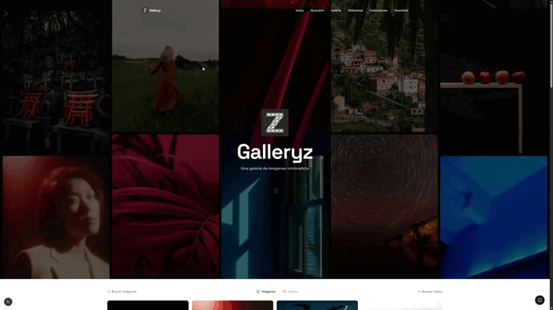

<h1 align="center">
  <span style="color:#18181B">📷 Galleryz</span>
</h1>

<p align="center">
  Por si quieres ver — <a href="https://galleryz.vercel.app"><strong>Live Demo</strong></a>
</p>

<p align="center">
  
</p>

### Documentación técnica

<p align="left">
  <a href="docs/Galleryz_Documentacion_Tecnica.pdf"><strong>📄 Documentación Técnica (PDF)</strong></a>
  <br/>
  <a href="docs/Galleryz_Manual_de_Usuario.pdf"><strong>📘 Manual de Usuario (PDF)</strong></a>
</p>

---

## ¿Qué es este proyecto?

**Galleryz** es una galería minimalista de fotos y videos construida con Next.js, que permite:

- Descubrir contenido destacado en un feed combinado de fotos y videos (**Descubrir**).
- Explorar una **Galería** de fotografías y una **Videoteca** con carga progresiva.
- Buscar fotos o videos por palabra clave, con filtros avanzados de orientación, tamaño y color.
- Navegar **Colecciones** temáticas curadas, cada una con su propio detalle de medios.
- Guardar fotos y videos como **favoritos**, persistidos en `localStorage` del navegador.
- Adaptarse automáticamente a modo claro/oscuro según la preferencia del sistema.

No hay sistema de cuentas ni backend propio de usuarios: **no existe login, registro ni base de datos**. Todo el estado del usuario (favoritos) vive en `localStorage`, en el propio navegador.

Los datos de fotos y videos se obtienen de la **API de Pexels**, consumida a través de rutas de API propias (carpeta `app/api/`) que ocultan la API key al cliente.

---

## Tecnologías utilizadas

| Categoría | Tecnología |
|---|---|
| Framework | Next.js 16 (App Router) |
| Librería UI | React 19 |
| Lenguaje | TypeScript |
| Estilos | Tailwind CSS 4 |
| Componentes UI | @base-ui/react + shadcn |
| Iconos | lucide-react |
| Notificaciones | sonner |
| Temas | next-themes |
| Backend | Route Handlers de Next.js (`app/api/`) que hacen de proxy a la API de Pexels |
| Deploy | Vercel |

---

## Estructura del proyecto

```
app/
├── api/                      # Route Handlers (proxy a Pexels, ocultan la API key)
│   ├── photos/                # Fotos curadas
│   ├── videos/                # Videos populares
│   ├── collections/            # Colecciones destacadas y detalle por id
│   └── search/                # Búsqueda de fotos y videos
├── collections/               # Vista de colecciones y detalle (/collections/[id])
├── descubrir/                  # Feed de descubrimiento (/descubrir)
├── galeria/                    # Galería de fotos (/galeria)
├── videoteca/                  # Galería de videos (/videoteca)
├── favoritos/                  # Elementos guardados como favoritos (/favoritos)
└── politica-de-privacidad/     # Aviso legal

components/
├── nav.tsx, hero.tsx            # Navegación y portada
├── gallery.tsx, gallery-section.tsx, video-gallery.tsx  # Grillas de contenido
├── discover-feed.tsx            # Feed combinado de descubrimiento
├── collections-view.tsx, collection-media-view.tsx      # Colecciones
├── favorites-view.tsx           # Vista de favoritos
├── photo-search.tsx, video-search.tsx, filter-dialog.tsx # Búsqueda y filtros
├── content-tabs.tsx, image-with-skeleton.tsx, visit-tracker.tsx, info-menu.tsx
└── ui/                          # Primitivas de interfaz (botón, diálogo, sonner)

lib/
├── pexels.ts                    # Cliente tipado de la API de Pexels
├── favorites.ts                 # Gestión de favoritos en localStorage
├── visit-tracking-service.ts    # Registro de visitas
└── utils.ts                     # Utilidades compartidas
```

---

## Cómo iniciar el proyecto

### Requisitos previos

- Node.js 18+
- npm
- Una [API key de Pexels](https://www.pexels.com/api/)

### Instalación

```bash
npm install
```

### Variables de entorno

Copia `.env.example` a `.env` y añade tu API key de Pexels (solo se usa en las rutas de API de `app/api/`, nunca se expone al cliente):

```bash
cp .env.example .env
```

```
PEXELS_API_KEY=tu_api_key_de_pexels
```

### Desarrollo local

```bash
npm run dev
```

Abre [http://localhost:3000](http://localhost:3000).

### Build de producción

```bash
npm run build
npm run start
```

---

## Deploy

El proyecto está pensado para desplegarse en **Vercel**: detecta automáticamente el framework Next.js. Solo hace falta configurar la variable de entorno `PEXELS_API_KEY` en el dashboard del proyecto.

1. Sube el repositorio a GitHub (ya está conectado a `origin`).
2. Importa el repo en [vercel.com/new](https://vercel.com/new).
3. En **Environment Variables** añade:
   - `PEXELS_API_KEY` — tu API key de [pexels.com/api](https://www.pexels.com/api/).
4. Deploy.

---

## Learn More

- [Next.js Documentation](https://nextjs.org/docs)
- [Pexels API Documentation](https://www.pexels.com/api/documentation/)
